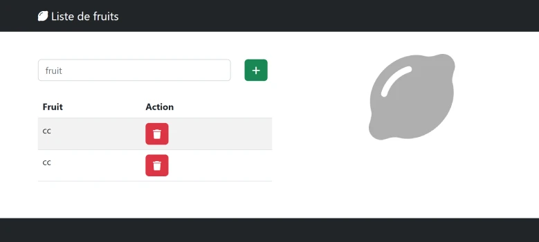

# Correction TP3
 
  
  

## partie HTML
```html
  <!-- [...] -->
  <table class="table table-striped mt-4">
      <thead>
      <tr>
          <th>Fruit</th>
          <th>Action</th>
      </tr>
      </thead>
      <!-- zone de dépot -->
      <tbody id="myTbody"></tbody>
  </table>
  <!-- [...] -->

    <script src="tp3.js" defer></script>
  </body>
```

## partie  JavaScript
```js
document.getElementById("btnAjouter").onclick = () => {
    // le selecteur
    const myTbody = document.getElementById('myTbody');

    const fruit = document.getElementById('fruit').value;
    document.getElementById('fruit').value=''; // vider input
    
    const tr = document.createElement('tr'); //<tr></tr>
    const td1 = document.createElement('td'); //<td></td>
    td1.innerHTML=fruit;
    tr.append(td1);

    const td2 = document.createElement('td');//<td></td>
    const button = document.createElement('button'); //<button></button>
    button.classList.add('btn','btn-danger');
    const i = document.createElement('i');//<i></i>
   
    i.classList.add('fa','fa-trash');//<i class="fa fa-trash"></i>
    button.appendChild(i);
    // la function du bouton
    button.onclick=(event)=>{
        event.target.closest('tr').remove();
        // event.target.parentElement.parentElement.remove(); // autre possibilité
    }
    td2.appendChild(button);
    tr.appendChild(td2);
    
    myTbody.appendChild(tr);  
    
};
```
