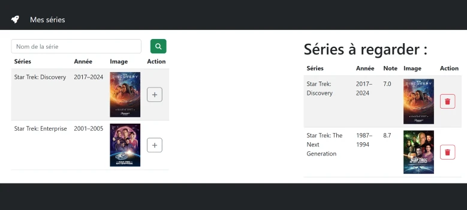

# Correcyion TP 07
  
  
  


### tp7.html
```html
<button class="btn btn-success" id="btnSearch">
    <i class="fa-solid fa-magnifying-glass"></i>
</button>
<!-- [...] -->
<table class="table table-striped">
    <thead>
        <tr>
        <th>Séries</th>
        <th>Année</th>
        <th>Image</th>
        <th>Action</th>
        </tr>
    </thead>
    <tbody id="myTbody"></tbody>
</table>
<!-- [...] -->
<table class="table table-striped">
    <thead>
        <tr>
        <th>Séries</th>
        <th>Année</th>
        <th>Note</th>
        <th>Image</th>
        <th>Action</th>
        </tr>
    </thead>
    <tbody id="myTbody2"></tbody>
</table>
<!-- [...] -->
<template id="templateTr">
      <tr>
        <td></td>
        <td></td>
        <td>
          
        </td>
        <td class="align-middle">
          <button class="btn btn-outline-secondary">
            <i class="fa fa-plus"></i>
          </button>
        </td>
      </tr>
    </template>
    <template id="templateTr2">
      <tr>
        <td></td>
        <td></td>
        <td></td>
        <td>
          
        </td>
        <td class="align-middle">
          <button class="btn btn-outline-danger">
            <i class="fa fa-trash"></i>
          </button>
        </td>
      </tr>
    </template>
<!-- [...] -->
## tp7.js
```js
let series = [];
let tabFav = [];
//---------------------------------------------
const saveLocal =()=>{
    localStorage.setItem('series',JSON.stringify(tabFav));
}
//---------------------------------------------
const getSerie = async (imdb) => {
    let key = "efdc2275";
    let url = "http://www.omdbapi.com/?apikey=" + key + "&i=" + imdb ;
    const response = await fetch(url);
    const serie = await response.json();
    return serie;
}
//---------------------------------------------

const afficheSeries =  () => {
const tbody = document.getElementById("myTbody");
  tbody.innerHTML = "";
  for (let s of series) {
    const template = document.getElementById("templateTr");
    const clone = template.content.cloneNode(true);
    const td = clone.querySelectorAll("td");
    td[0].innerHTML = s.Title;
    td[1].innerHTML = s.Year;
    clone.querySelector("img").src = s.Poster;
    clone.querySelector("img").alt = s.Title;
    clone.querySelector("button").onclick = async (evt) => {
      const tr = evt.target.closest("tr");
      const i = tr.rowIndex - 1;
      let serie= await getSerie(series[i].imdbID);
    
       tabFav.push(serie);
      afficherFav();
      series.splice(i, 1);
      afficheSeries();
      saveLocal();// ici <--- localStorage
    };
    tbody.append(clone);
  }
};
//---------------------------------------------
const afficherFav = () => {
  const tbody2 = document.getElementById("myTbody2");
  tbody2.innerHTML = "";

  for (let f of tabFav) {
    const template = document.getElementById("templateTr2");
    const clone = template.content.cloneNode(true);
    const td = clone.querySelectorAll("td");
    
    td[0].innerHTML = f.Title;
    td[1].innerHTML = f.Year;
    td[2].innerHTML = f.imdbRating;
    clone.querySelector("img").src = f.Poster;
    clone.querySelector("img").alt = f.Title;
    clone.querySelector("button").onclick = (evt) => {
      const tr = evt.target.closest("tr");
      const i = tr.rowIndex - 1;
      tabFav.splice(i, 1);
      afficherFav();
      saveLocal();// ici <--- localStorage
    };
    tbody2.append(clone);
  }
};
//---------------------------------------------
document.getElementById("btnSearch").onclick = async () => {
  
  let film = document.getElementById("film").value;
  document.getElementById("film").value = "";
  let key = "efdc2275";
  let url = "http://www.omdbapi.com/?apikey=" + key + "&s=" + film + "&type=series";
  const response = await fetch(url);
  const data = await response.json();

  series = data.Search;
  afficheSeries();
};
//---------------------------------------------
const data = localStorage.getItem('series');
if (data){
    tabFav= JSON.parse(data);
    afficherFav();
}
//---------------------------------------------
```